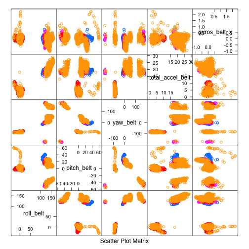
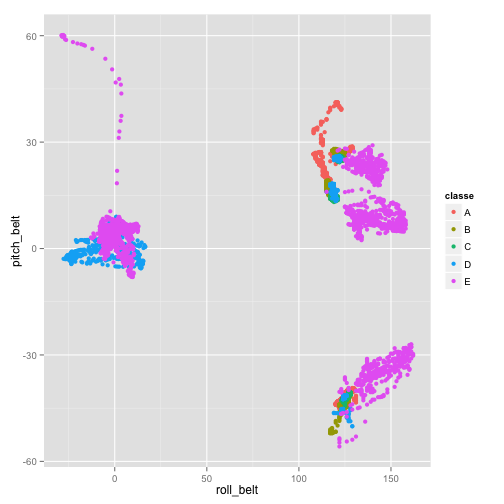
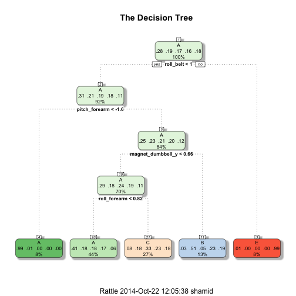

## Practical Machine Learning - Prediction Project

Velloso, E.; Bulling, A.; Gellersen, H.; Ugulino, W.; Fuks, H. Qualitative Activity Recognition of Weight Lifting Exercises. Proceedings of 4th International Conference in Cooperation with SIGCHI (Augmented Human '13) . Stuttgart, Germany: ACM SIGCHI, 2013.

The study given in the article above, there are six participants participated in a dumbell lifting exercise five different ways. The five ways, as described in the study, were “exactly according to the specification (Class A), throwing the elbows to the front (Class B), lifting the dumbbell only halfway (Class C), lowering the dumbbell only halfway (Class D) and throwing the hips to the front (Class E). Class A corresponds to the specified execution of the exercise, while the other 4 classes correspond to common mistakes.”

The goal of this project is to predict the manner in which they did the exercise.

The “Components of a Predictor” consists of five stages:

* Question
* Input Data
* Features
* Algorithm
* Parameters
* Evaluation

## Question

By processing data gathered from accelerometers on the belt, forearm, arm, and dumbell of the participants in a machine learning algorithm, the question is how can we predict appropriate activity quality (class A-E) ?

## Input Data
First, I'll load the appropriate packages and set the seed for reproduceable results.

```r
library(AppliedPredictiveModeling)
library(caret)
library(rattle)
library(rpart.plot)
library(randomForest)
library(ggplot2)
set.seed(137)
```

First, I download the data if not given in the working directory. While loading the datasets I treat empty values as NA. Then I verify that the training and testing data are identical.


```r
training_file <- "pml-training.csv"
if (!file.exists(training_file)){
dataUrl_training <- "https://d396qusza40orc.cloudfront.net/predmachlearn/pml-training.csv"
download.file(url=dataUrl_training, training_file, method="curl")
}
testing_file <- "pml-testing.csv"
if (!file.exists(testing_file)){
dataUrl_testing <- "https://d396qusza40orc.cloudfront.net/predmachlearn/pml-testing.csv"
download.file(url=dataUrl_testing, testing_file, method="curl")  
}
training_data <- read.csv(training_file, na.strings=c("NA",""), header=TRUE )
eval_data <- read.csv(testing_file, na.strings=c("NA",""), header=TRUE )
training_var <- colnames(training_data)
testing_var <- colnames(eval_data)
# Verify that the column names (excluding classe and problem_id) are identical in the training and # test set.
all.equal(training_var[1:length(training_var)-1], testing_var[1:length(testing_var)-1])
```

```
## [1] TRUE
```

```r
dim(training_data)
```

```
## [1] 19622   160
```

The training data consists of 160 variables, but many of the variables are sparse, meaning that they only have observations for a few of the data points. These sparse variables may have predictive value, but because they are observed so infrequently they become fairly useless for classifying most of the data points that do not contain these observations. Therefore it makes sense to filter these inputs out and focus the prediction efforts on variables that have at least 90% of their observations filled in.

## Feature
I remove variables with more than 90% missing values. 

```r
nav <- sapply(colnames(training_data), function(x) if(sum(is.na(training_data[, x])) > 0.9*nrow(training_data)){return(T)}else{return(F)})
training_data <- training_data[, !nav]
names(training_data)
```

```
##  [1] "X"                    "user_name"            "raw_timestamp_part_1"
##  [4] "raw_timestamp_part_2" "cvtd_timestamp"       "new_window"          
##  [7] "num_window"           "roll_belt"            "pitch_belt"          
## [10] "yaw_belt"             "total_accel_belt"     "gyros_belt_x"        
## [13] "gyros_belt_y"         "gyros_belt_z"         "accel_belt_x"        
## [16] "accel_belt_y"         "accel_belt_z"         "magnet_belt_x"       
## [19] "magnet_belt_y"        "magnet_belt_z"        "roll_arm"            
## [22] "pitch_arm"            "yaw_arm"              "total_accel_arm"     
## [25] "gyros_arm_x"          "gyros_arm_y"          "gyros_arm_z"         
## [28] "accel_arm_x"          "accel_arm_y"          "accel_arm_z"         
## [31] "magnet_arm_x"         "magnet_arm_y"         "magnet_arm_z"        
## [34] "roll_dumbbell"        "pitch_dumbbell"       "yaw_dumbbell"        
## [37] "total_accel_dumbbell" "gyros_dumbbell_x"     "gyros_dumbbell_y"    
## [40] "gyros_dumbbell_z"     "accel_dumbbell_x"     "accel_dumbbell_y"    
## [43] "accel_dumbbell_z"     "magnet_dumbbell_x"    "magnet_dumbbell_y"   
## [46] "magnet_dumbbell_z"    "roll_forearm"         "pitch_forearm"       
## [49] "yaw_forearm"          "total_accel_forearm"  "gyros_forearm_x"     
## [52] "gyros_forearm_y"      "gyros_forearm_z"      "accel_forearm_x"     
## [55] "accel_forearm_y"      "accel_forearm_z"      "magnet_forearm_x"    
## [58] "magnet_forearm_y"     "magnet_forearm_z"     "classe"
```
There were a lots of missing data. Now the training data contains only 60 variables. Let's also remove user name, timestamps and windows as they are unnecessary for predicting.

```r
training_data <- training_data[,8:ncol(training_data)]
names(training_data)
```

```
##  [1] "roll_belt"            "pitch_belt"           "yaw_belt"            
##  [4] "total_accel_belt"     "gyros_belt_x"         "gyros_belt_y"        
##  [7] "gyros_belt_z"         "accel_belt_x"         "accel_belt_y"        
## [10] "accel_belt_z"         "magnet_belt_x"        "magnet_belt_y"       
## [13] "magnet_belt_z"        "roll_arm"             "pitch_arm"           
## [16] "yaw_arm"              "total_accel_arm"      "gyros_arm_x"         
## [19] "gyros_arm_y"          "gyros_arm_z"          "accel_arm_x"         
## [22] "accel_arm_y"          "accel_arm_z"          "magnet_arm_x"        
## [25] "magnet_arm_y"         "magnet_arm_z"         "roll_dumbbell"       
## [28] "pitch_dumbbell"       "yaw_dumbbell"         "total_accel_dumbbell"
## [31] "gyros_dumbbell_x"     "gyros_dumbbell_y"     "gyros_dumbbell_z"    
## [34] "accel_dumbbell_x"     "accel_dumbbell_y"     "accel_dumbbell_z"    
## [37] "magnet_dumbbell_x"    "magnet_dumbbell_y"    "magnet_dumbbell_z"   
## [40] "roll_forearm"         "pitch_forearm"        "yaw_forearm"         
## [43] "total_accel_forearm"  "gyros_forearm_x"      "gyros_forearm_y"     
## [46] "gyros_forearm_z"      "accel_forearm_x"      "accel_forearm_y"     
## [49] "accel_forearm_z"      "magnet_forearm_x"     "magnet_forearm_y"    
## [52] "magnet_forearm_z"     "classe"
```

In the context of covariate creation strategies, first check for covariates that have virtually on variablility. Depending on that we may have to create new covariates from the given variables.


```r
nsv <- nearZeroVar(training_data, saveMetrics = T)
training_data <- training_data[, !nsv$nzv]
nsv
```

```
##                      freqRatio percentUnique zeroVar   nzv
## roll_belt                1.102       6.77811   FALSE FALSE
## pitch_belt               1.036       9.37723   FALSE FALSE
## yaw_belt                 1.058       9.97350   FALSE FALSE
## total_accel_belt         1.063       0.14779   FALSE FALSE
## gyros_belt_x             1.059       0.71348   FALSE FALSE
## gyros_belt_y             1.144       0.35165   FALSE FALSE
## gyros_belt_z             1.066       0.86128   FALSE FALSE
## accel_belt_x             1.055       0.83580   FALSE FALSE
## accel_belt_y             1.114       0.72877   FALSE FALSE
## accel_belt_z             1.079       1.52380   FALSE FALSE
## magnet_belt_x            1.090       1.66650   FALSE FALSE
## magnet_belt_y            1.100       1.51870   FALSE FALSE
## magnet_belt_z            1.006       2.32902   FALSE FALSE
## roll_arm                52.338      13.52563   FALSE FALSE
## pitch_arm               87.256      15.73234   FALSE FALSE
## yaw_arm                 33.029      14.65702   FALSE FALSE
## total_accel_arm          1.025       0.33636   FALSE FALSE
## gyros_arm_x              1.016       3.27693   FALSE FALSE
## gyros_arm_y              1.454       1.91622   FALSE FALSE
## gyros_arm_z              1.111       1.26389   FALSE FALSE
## accel_arm_x              1.017       3.95984   FALSE FALSE
## accel_arm_y              1.140       2.73672   FALSE FALSE
## accel_arm_z              1.128       4.03629   FALSE FALSE
## magnet_arm_x             1.000       6.82397   FALSE FALSE
## magnet_arm_y             1.057       4.44399   FALSE FALSE
## magnet_arm_z             1.036       6.44685   FALSE FALSE
## roll_dumbbell            1.022      83.78351   FALSE FALSE
## pitch_dumbbell           2.277      81.22516   FALSE FALSE
## yaw_dumbbell             1.132      83.14137   FALSE FALSE
## total_accel_dumbbell     1.073       0.21914   FALSE FALSE
## gyros_dumbbell_x         1.003       1.22821   FALSE FALSE
## gyros_dumbbell_y         1.265       1.41678   FALSE FALSE
## gyros_dumbbell_z         1.060       1.04984   FALSE FALSE
## accel_dumbbell_x         1.018       2.16594   FALSE FALSE
## accel_dumbbell_y         1.053       2.37489   FALSE FALSE
## accel_dumbbell_z         1.133       2.08949   FALSE FALSE
## magnet_dumbbell_x        1.098       5.74865   FALSE FALSE
## magnet_dumbbell_y        1.198       4.30129   FALSE FALSE
## magnet_dumbbell_z        1.021       3.44511   FALSE FALSE
## roll_forearm            11.589      11.08959   FALSE FALSE
## pitch_forearm           65.983      14.85577   FALSE FALSE
## yaw_forearm             15.323      10.14677   FALSE FALSE
## total_accel_forearm      1.129       0.35674   FALSE FALSE
## gyros_forearm_x          1.059       1.51870   FALSE FALSE
## gyros_forearm_y          1.037       3.77637   FALSE FALSE
## gyros_forearm_z          1.123       1.56457   FALSE FALSE
## accel_forearm_x          1.126       4.04648   FALSE FALSE
## accel_forearm_y          1.059       5.11161   FALSE FALSE
## accel_forearm_z          1.006       2.95587   FALSE FALSE
## magnet_forearm_x         1.012       7.76679   FALSE FALSE
## magnet_forearm_y         1.247       9.54031   FALSE FALSE
## magnet_forearm_z         1.000       8.57711   FALSE FALSE
## classe                   1.470       0.02548   FALSE FALSE
```
Given that all of the near zero variance variables (nzv) are FALSE, there's no need to eliminate any covariates due to lack of variablility.

## Algorithm
The training set has 19622 samples and 52 potential predictors after filtering.

As we have a large training set (19622 entries) and a small evaluation set (20 entries), instead of performing the algorithm on the entire training set, as it would be time consuming and wouldn't allow for an attempt on a testing set, I chose it to split into a training (comprising 60% of the entries) and a testing set (comprising 40% of the entries).


```r
# Divide entire training set into training (60%) and test (40%) sets.
set.seed(137)
inTrain <- createDataPartition(y=training_data$classe, p=0.6, list=FALSE)
training <- training_data[inTrain,]
testing <- training_data[-inTrain,]
featurePlot(x = training[, 1:5], y = training$classe, plot = "pairs")
```

 

```r
qplot(roll_belt, pitch_belt, data = training, colour = classe)
```

 

We will choose two different algorithms via the caret package: classification trees (method = rpart) and random forests (method = rf). First I will try fresh classification trees and then introduce preprocessing and cross validation.

## Evaluation

### Classification Trees


```r
# Train the classification trees on the training set.
set.seed(137)
modFit <- train(training$classe ~ ., data = training, method="rpart")
print(modFit, digits=3)
```

```
## CART 
## 
## 11776 samples
##    52 predictor
##     5 classes: 'A', 'B', 'C', 'D', 'E' 
## 
## No pre-processing
## Resampling: Bootstrapped (25 reps) 
## 
## Summary of sample sizes: 11776, 11776, 11776, 11776, 11776, 11776, ... 
## 
## Resampling results across tuning parameters:
## 
##   cp      Accuracy  Kappa   Accuracy SD  Kappa SD
##   0.0349  0.498     0.3423  0.0642       0.1044  
##   0.0607  0.414     0.2058  0.0636       0.1050  
##   0.1160  0.330     0.0702  0.0428       0.0636  
## 
## Accuracy was used to select the optimal model using  the largest value.
## The final value used for the model was cp = 0.0349.
```

```r
print(modFit$finalModel, digits=3)
```

```
## n= 11776 
## 
## node), split, n, loss, yval, (yprob)
##       * denotes terminal node
## 
##  1) root 11776 8430 A (0.28 0.19 0.17 0.16 0.18)  
##    2) roll_belt< 130 10782 7440 A (0.31 0.21 0.19 0.18 0.11)  
##      4) pitch_forearm< -34.6 923    5 A (0.99 0.0054 0 0 0) *
##      5) pitch_forearm>=-34.6 9859 7440 A (0.25 0.23 0.21 0.2 0.12)  
##       10) magnet_dumbbell_y< 438 8302 5930 A (0.29 0.18 0.24 0.19 0.11)  
##         20) roll_forearm< 122 5149 3020 A (0.41 0.18 0.18 0.17 0.059) *
##         21) roll_forearm>=122 3153 2110 C (0.078 0.18 0.33 0.23 0.18) *
##       11) magnet_dumbbell_y>=438 1557  768 B (0.033 0.51 0.046 0.23 0.19) *
##    3) roll_belt>=130 994    8 E (0.008 0 0 0 0.99) *
```

```r
# Run against testing set.
predictions <- predict(modFit, newdata=testing)
cm <- confusionMatrix(predictions, testing$classe)
print(cm, digits=4)
```

```
## Confusion Matrix and Statistics
## 
##           Reference
## Prediction    A    B    C    D    E
##          A 2024  628  646  577  217
##          B   36  505   37  220  197
##          C  166  385  685  489  383
##          D    0    0    0    0    0
##          E    6    0    0    0  645
## 
## Overall Statistics
##                                          
##                Accuracy : 0.4918         
##                  95% CI : (0.4807, 0.503)
##     No Information Rate : 0.2845         
##     P-Value [Acc > NIR] : < 2.2e-16      
##                                          
##                   Kappa : 0.3357         
##  Mcnemar's Test P-Value : NA             
## 
## Statistics by Class:
## 
##                      Class: A Class: B Class: C Class: D Class: E
## Sensitivity            0.9068  0.33267  0.50073   0.0000  0.44730
## Specificity            0.6316  0.92257  0.78033   1.0000  0.99906
## Pos Pred Value         0.4946  0.50754  0.32495      NaN  0.99078
## Neg Pred Value         0.9446  0.85214  0.88097   0.8361  0.88923
## Prevalence             0.2845  0.19347  0.17436   0.1639  0.18379
## Detection Rate         0.2580  0.06436  0.08731   0.0000  0.08221
## Detection Prevalence   0.5215  0.12682  0.26867   0.0000  0.08297
## Balanced Accuracy      0.7692  0.62762  0.64053   0.5000  0.72318
```

The accuracy rate is very low (0.4918), let's try to improve it by incorporating preprocessing and/or cross validation.


```r
set.seed(137)
modFit <- train(training$classe ~ .,  preProcess=c("center", "scale"), trControl=trainControl(method = "cv", number = 4), data = training, method="rpart")
print(modFit, digits=3)
```

```
## CART 
## 
## 11776 samples
##    52 predictor
##     5 classes: 'A', 'B', 'C', 'D', 'E' 
## 
## Pre-processing: centered, scaled 
## Resampling: Cross-Validated (4 fold) 
## 
## Summary of sample sizes: 8832, 8832, 8833, 8831 
## 
## Resampling results across tuning parameters:
## 
##   cp      Accuracy  Kappa  Accuracy SD  Kappa SD
##   0.0349  0.481     0.313  0.0792       0.1291  
##   0.0607  0.430     0.232  0.0667       0.1139  
##   0.1160  0.323     0.060  0.0451       0.0692  
## 
## Accuracy was used to select the optimal model using  the largest value.
## The final value used for the model was cp = 0.0349.
```

```r
# Run against testing with both preprocessings and 4-fold cross validations.
fancyRpartPlot(modFit$finalModel, main="The Decision Tree")
```

 

```r
predictions <- predict(modFit, newdata=testing)
cm2 <- confusionMatrix(predictions, testing$classe)
print(cm2, digits=4)
```

```
## Confusion Matrix and Statistics
## 
##           Reference
## Prediction    A    B    C    D    E
##          A 2024  628  646  577  217
##          B   36  505   37  220  197
##          C  166  385  685  489  383
##          D    0    0    0    0    0
##          E    6    0    0    0  645
## 
## Overall Statistics
##                                          
##                Accuracy : 0.4918         
##                  95% CI : (0.4807, 0.503)
##     No Information Rate : 0.2845         
##     P-Value [Acc > NIR] : < 2.2e-16      
##                                          
##                   Kappa : 0.3357         
##  Mcnemar's Test P-Value : NA             
## 
## Statistics by Class:
## 
##                      Class: A Class: B Class: C Class: D Class: E
## Sensitivity            0.9068  0.33267  0.50073   0.0000  0.44730
## Specificity            0.6316  0.92257  0.78033   1.0000  0.99906
## Pos Pred Value         0.4946  0.50754  0.32495      NaN  0.99078
## Neg Pred Value         0.9446  0.85214  0.88097   0.8361  0.88923
## Prevalence             0.2845  0.19347  0.17436   0.1639  0.18379
## Detection Rate         0.2580  0.06436  0.08731   0.0000  0.08221
## Detection Prevalence   0.5215  0.12682  0.26867   0.0000  0.08297
## Balanced Accuracy      0.7692  0.62762  0.64053   0.5000  0.72318
```

When we run against the corresponding testing set, the accuracy rate is identical (0.4918) before and after 
the preprocessing/cross validation steps.

### Random Forest

In the random forest algorithm, first we will use cross validation to sub sample the data and test it over 4 cross validation sets.


```r
# Train on training set with only cross validation.
set.seed(137)
modFit <- train(training$classe ~ ., method="rf", trControl=trainControl(method = "cv", number = 4), data=training)
print(modFit, digits=3)
```

```
## Random Forest 
## 
## 11776 samples
##    52 predictor
##     5 classes: 'A', 'B', 'C', 'D', 'E' 
## 
## No pre-processing
## Resampling: Cross-Validated (4 fold) 
## 
## Summary of sample sizes: 8832, 8832, 8833, 8831 
## 
## Resampling results across tuning parameters:
## 
##   mtry  Accuracy  Kappa  Accuracy SD  Kappa SD
##    2    0.987     0.984  0.00347      0.00438 
##   27    0.987     0.984  0.00336      0.00425 
##   52    0.982     0.977  0.00562      0.00711 
## 
## Accuracy was used to select the optimal model using  the largest value.
## The final value used for the model was mtry = 27.
```

```r
# Run against testing set.
predictions <- predict(modFit, newdata=testing)
cm3 <- confusionMatrix(predictions, testing$classe)
print(cm3, digits=4)
```

```
## Confusion Matrix and Statistics
## 
##           Reference
## Prediction    A    B    C    D    E
##          A 2226   19    0    0    0
##          B    4 1489    3    0    0
##          C    0    9 1361   10    2
##          D    0    1    4 1275   12
##          E    2    0    0    1 1428
## 
## Overall Statistics
##                                           
##                Accuracy : 0.9915          
##                  95% CI : (0.9892, 0.9934)
##     No Information Rate : 0.2845          
##     P-Value [Acc > NIR] : < 2.2e-16       
##                                           
##                   Kappa : 0.9892          
##  Mcnemar's Test P-Value : NA              
## 
## Statistics by Class:
## 
##                      Class: A Class: B Class: C Class: D Class: E
## Sensitivity            0.9973   0.9809   0.9949   0.9914   0.9903
## Specificity            0.9966   0.9989   0.9968   0.9974   0.9995
## Pos Pred Value         0.9915   0.9953   0.9848   0.9868   0.9979
## Neg Pred Value         0.9989   0.9954   0.9989   0.9983   0.9978
## Prevalence             0.2845   0.1935   0.1744   0.1639   0.1838
## Detection Rate         0.2837   0.1898   0.1735   0.1625   0.1820
## Detection Prevalence   0.2861   0.1907   0.1761   0.1647   0.1824
## Balanced Accuracy      0.9970   0.9899   0.9958   0.9944   0.9949
```

```r
# Run against 20 evaluation set.
print(predict(modFit, newdata=eval_data))
```

```
##  [1] B A B A A E D B A A B C B A E E A B B B
## Levels: A B C D E
```

The random forest algorithm generated a very accurate model with accuracy 0.9915. Compared to the classification tree, this model generally has better performance in terms of accuracy as we see from the confusion matrix.


```r
set.seed(137)
# Train on training set with both preprocessing and cross validation.
modFit <- train(training$classe ~ ., method="rf", preProcess=c("center", "scale"), trControl=trainControl(method = "cv", number = 4), data=training)
print(modFit, digits=3)
```

```
## Random Forest 
## 
## 11776 samples
##    52 predictor
##     5 classes: 'A', 'B', 'C', 'D', 'E' 
## 
## Pre-processing: centered, scaled 
## Resampling: Cross-Validated (4 fold) 
## 
## Summary of sample sizes: 8832, 8832, 8833, 8831 
## 
## Resampling results across tuning parameters:
## 
##   mtry  Accuracy  Kappa  Accuracy SD  Kappa SD
##    2    0.987     0.984  0.00334      0.00423 
##   27    0.987     0.984  0.00311      0.00394 
##   52    0.981     0.976  0.00637      0.00805 
## 
## Accuracy was used to select the optimal model using  the largest value.
## The final value used for the model was mtry = 27.
```

```r
# Run against testing set.
predictions <- predict(modFit, newdata=testing)
cm4 <- confusionMatrix(predictions, testing$classe)
print(cm4, digits=4)
```

```
## Confusion Matrix and Statistics
## 
##           Reference
## Prediction    A    B    C    D    E
##          A 2226   20    0    0    0
##          B    4 1490    3    0    0
##          C    0    7 1361    8    3
##          D    0    1    4 1277   11
##          E    2    0    0    1 1428
## 
## Overall Statistics
##                                           
##                Accuracy : 0.9918          
##                  95% CI : (0.9896, 0.9937)
##     No Information Rate : 0.2845          
##     P-Value [Acc > NIR] : < 2.2e-16       
##                                           
##                   Kappa : 0.9897          
##  Mcnemar's Test P-Value : NA              
## 
## Statistics by Class:
## 
##                      Class: A Class: B Class: C Class: D Class: E
## Sensitivity            0.9973   0.9816   0.9949   0.9930   0.9903
## Specificity            0.9964   0.9989   0.9972   0.9976   0.9995
## Pos Pred Value         0.9911   0.9953   0.9869   0.9876   0.9979
## Neg Pred Value         0.9989   0.9956   0.9989   0.9986   0.9978
## Prevalence             0.2845   0.1935   0.1744   0.1639   0.1838
## Detection Rate         0.2837   0.1899   0.1735   0.1628   0.1820
## Detection Prevalence   0.2863   0.1908   0.1758   0.1648   0.1824
## Balanced Accuracy      0.9969   0.9902   0.9961   0.9953   0.9949
```

When running against the corresponding set, the accuracy rate rose from 0.9915 to 0.9918 with the addition of preprocessing. Thus I decided to apply random forest algorithm with both preprocessing and cross validation to the evaluation set.


```r
# Run against 20 evaluation set.
result <- predict(modFit, newdata=eval_data)
```

```
## Loading required package: randomForest
```

```
## Warning: package 'randomForest' was built under R version 3.1.1
```

```
## randomForest 4.6-10
## Type rfNews() to see new features/changes/bug fixes.
```

```r
pml_write_files = function(x){
  n = length(x)
  for(i in 1:n){
    filename = paste0("problem_id_",i,".txt")
    write.table(x[i],file=filename,quote=FALSE,row.names=FALSE,col.names=FALSE)
  }
}

pml_write_files(result)
```

### Out of Sample Error

The out of sample error is the “error rate on new data set”. As reported by the final model of the Random Forest (preprocessing and cross validation) algorithm is 0.0082 %.

 
 ```r
 # parallel tree processing
 # library(doParallel)
 # library(foreach)
 # x <- training[1:ncol(training)-1]
 # y <- training$classe
 # 
 # rf <- foreach(ntree=rep(150, 6), .combine=randomForest::combine, .packages='randomForest') %dopar% {
 #   randomForest(x, y, ntree=ntree) 
 # }
 # 
 # predictions <- predict(rf, newdata=testing)
 # cm4 <- confusionMatrix(predictions, testing$classe)
 # print(cm4, digits=4)
 # ```
 ```
